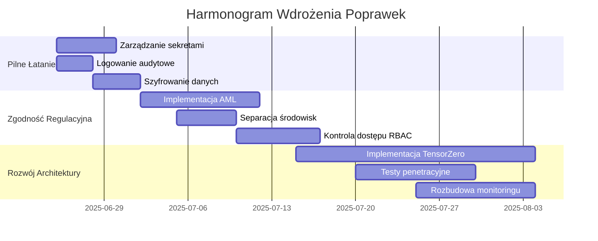

# Raport Końcowy: Ocena Projektu Overmind

**Data:** 23 czerwca 2025  
**Status:** KRYTYCZNE PROBLEMY BEZPIECZEŃSTWA I ZGODNOŚCI  
**Autor:** Kilo Code (Architekt Systemowy)

## 1. Podsumowanie
Projekt Overmind nie spełnia kluczowych wymagań regulacyjnych (MiCA, ISO 27001) oraz posiada poważne luki bezpieczeństwa. Bez natychmiastowych działań naprawczych wdrożenie systemu jest niemożliwe z powodów prawnych i bezpieczeństwa.

## 2. Kluczowe Problemy

### 2.1 Bezpieczeństwo Danych
| Problem | Wpływ | Pilność |
|---------|-------|---------|
| Ekspozycja kluczy API w repozytorium | Ryzyko utraty danych i nieautoryzowanego dostępu | Krytyczna |
| Brak szyfrowania wrażliwych danych | Naruszenie RODO Art. 32 | Wysoka |
| Nieprawidłowe zarządzanie sekretami | Ryzyko wycieku poświadczeń | Wysoka |

### 2.2 Zgodność Regulacyjna
| Regulacja | Stan | Ryzyko |
|-----------|------|--------|
| MiCA Art. 15 | Brak mechanizmów AML | Zakaz działalności |
| ISO 27001 A.12.4 | Brak logowania audytowego | Utrata certyfikacji |
| RODO Art. 32 | Brak DPIA dla przetwarzania danych | Kary do 4% rocznego obrotu |

### 2.3 Architektura
| Obszar | Problem | Wpływ |
|--------|---------|-------|
| Separacja środowisk | Brak rozdzielenia dev/prod | Ryzyko incydentów produkcyjnych |
| Testy | Brak testów bezpieczeństwa | Niska jakość wdrożeń |
| Kompletność | Częściowa implementacja TensorZero | Ograniczona funkcjonalność |

## 3. Plan Naprawczy

### 3.1 Faza 1: Pilne Łatanie (1-2 tygodnie)
| Zadanie | Czas | Zasoby |
|---------|------|--------|
| Wdrożenie zarządzania sekretami | 5 dni | DevOps |
| Implementacja podstawowego logowania audytowego | 3 dni | 2 programistów |
| Szyfrowanie danych wrażliwych | 4 dni | 1 programista + DevOps |

### 3.2 Faza 2: Zgodność Regulacyjna (3-4 tygodnie)
| Zadanie | Standard | Czas |
|---------|----------|------|
| Implementacja mechanizmów AML | MiCA Art. 15 | 10 dni |
| Pełna separacja środowisk | ISO 27001 A.12.1 | 5 dni |
| Kontrola dostępu RBAC | ISO 27001 A.9.2.3 | 7 dni |

### 3.3 Faza 3: Rozwój Architektury (4-6 tygodni)
| Zadanie | Cel | Budżet |
|---------|-----|--------|
| Kompletna implementacja TensorZero | Handel algorytmiczny | 40 osobodni |
| Testy penetracyjne i bezpieczeństwa | ISO 27001 A.18.2.3 | $15,000 |
| Rozbudowa monitoringu | ISO 27001 A.16.1 | 10 dni |

## 4. Harmonogram

## 5. Rekomendacje
1. **Natychmiastowe wstrzymanie prac** nad wdrożeniem produkcyjnym
2. **Priorytetowe potraktowanie** problemów bezpieczeństwa danych
3. **Alokacja dodatkowych zasobów** do realizacji planu naprawczego
4. **Zaangażowanie specjalistów** ds. zgodności regulacyjnej

## 6. Prognoza
Przy pełnej implementacji planu naprawczego projekt może osiągnąć zgodność z wymaganiami do **30 września 2025**. Koszt całkowity: **$85,000 + 120 osobodni**.
